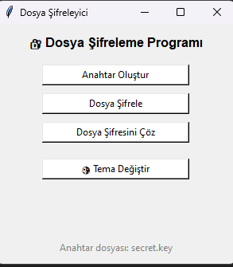
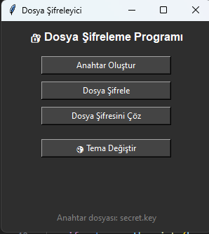

# FileEncryptionProgramwithPythonGUI
# 🔐 Dosya Şifreleme Programı (Python + GUI)

Bu proje, Python kullanılarak geliştirilmiş **grafik arayüzlü (GUI)** bir **dosya şifreleme ve şifre çözme uygulamasıdır**. Kullanıcı dostu bir arayüz sayesinde dosyalarınızı kolayca şifreleyebilir ve çözebilirsiniz.

## ✨ Özellikler

- 📂 Dosya seçme arayüzü (Tkinter ile)
- 🔐 Fernet (AES tabanlı) ile güçlü dosya şifreleme
- 🔓 Şifre çözme desteği
- 🗝️ Anahtar oluşturma ve saklama
- 🌗 Gece/Gündüz Teması (dark/light mode)
- ✅ Kullanıcı dostu arayüz

## 🖼️ Arayüz Görünümü

| Açık Tema | Karanlık Tema |
|----------|----------------|
|  |  |


## 📦 Kurulum

1. Python 3.x yüklü olduğundan emin olun.
2. Gerekli kütüphaneyi yükleyin:
   ```bash
   pip install cryptography
